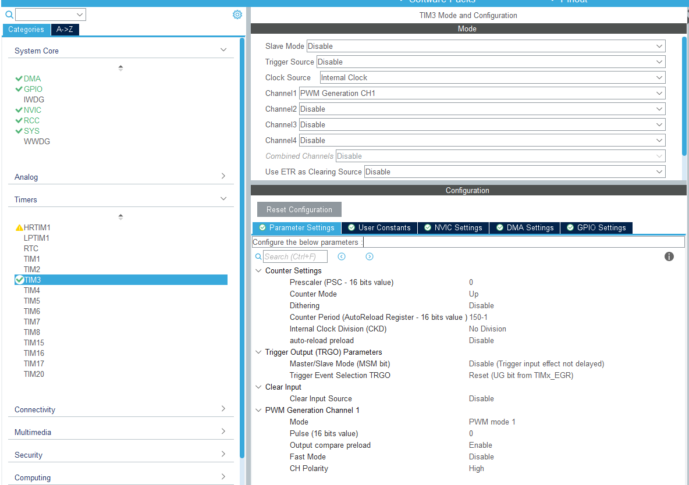
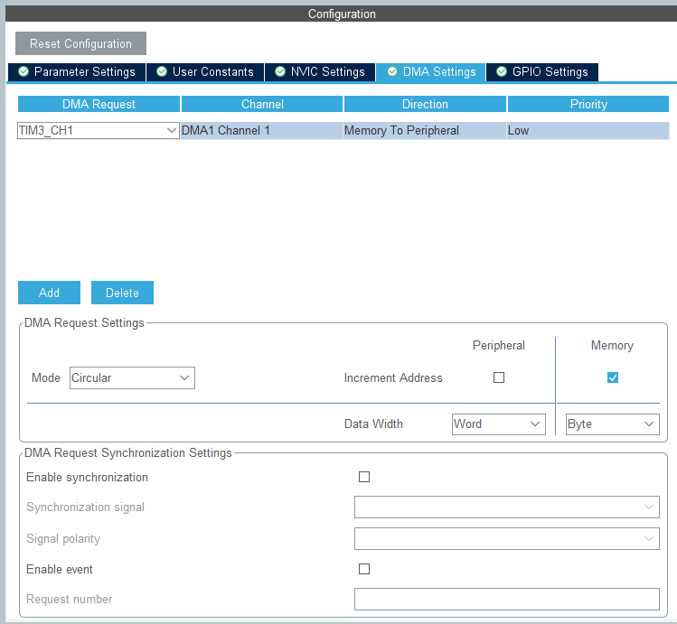
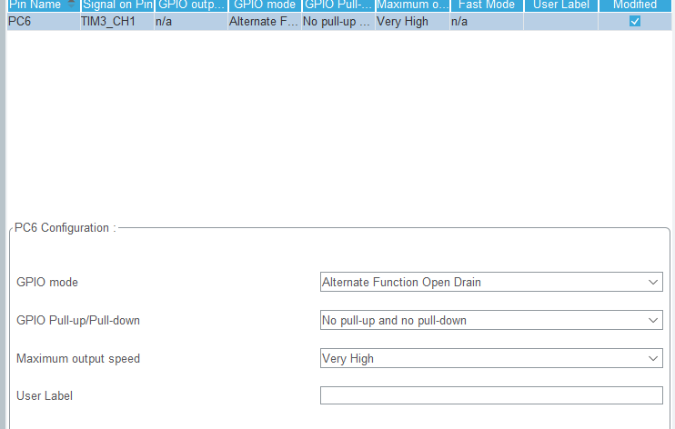
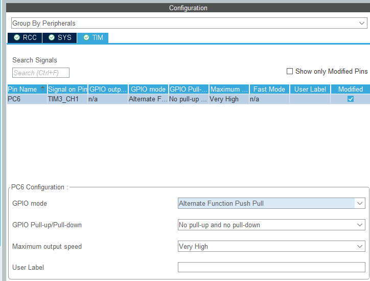

# WS2812

STM32 HAL library for one WS2812 strip, using PWM and circular DMA with a
48-byte buffer for two LEDs. The strip colors are stored separately in GRB
order. Timer and DMA initialization is generated by CubeMX.

## 1. Import the library

1. Copy `Core/Inc/ws2812.h` into your project's include directory.
2. Copy `Core/Src/ws2812.c` into your project's source directory.
3. Ensure that the source file is included in the build and the header directory
   is on the compiler include path. In STM32CubeIDE, refresh the project after copying.
4. Enable STM32 HAL TIM and DMA support. Generate peripheral initialization as
   separate `.c/.h` files in CubeMX so that `tim.h` declares the timer handle.
5. Include the library where it is used:

```c
#include "ws2812.h"
```

The current project uses STM32G474, TIM3 channel 1 and PC6.

## 2. Configure the timer in CubeMX

Select TIM3, Internal Clock and PWM Generation CH1. The following values use
an actual **timer input clock of 120 MHz**.

| Setting | Value |
| --- | --- |
| Prescaler | 0 |
| Counter mode | Up |
| Counter period (ARR) | 150 - 1 = 149 |
| Clock division | No Division |
| Auto-reload preload | Disable |
| PWM mode | PWM mode 1 |
| Pulse | 0 |
| Output compare preload | Enable |
| Fast mode | Disable |
| CH polarity | High for direct open-drain; Low for the MOSFET circuit below |



The screenshot shows the direct open-drain option. For the MOSFET option,
change CH Polarity to Low. Other timer and DMA settings stay unchanged.

The PWM frequency is `120 MHz / ((0 + 1) * (149 + 1)) = 800 kHz`.
Each period lasts 1.25 us. The library uses compare values 48 for a zero bit
and 95 for a one bit, giving high times of approximately 0.40 us and 0.79 us.
If the timer clock changes, recalculate both ARR and these compare values.
The current byte buffer requires compare values to fit in one byte.

## 3. Configure DMA and interrupts

Add a DMA request for **TIM3_CH1** using these settings:

| Setting | Value |
| --- | --- |
| DMA channel in this project | DMA1 Channel 1 |
| Direction | Memory to Peripheral |
| Mode | Circular |
| Priority | Low |
| Peripheral increment | Disabled |
| Memory increment | Enabled |
| Peripheral data width | Word |
| Memory data width | Byte |
| Request synchronization | Disabled |



Enable the DMA1 Channel 1 global interrupt in NVIC. In this project its priority
is 0. CubeMX must link the DMA handle to the timer's channel DMA slot and generate
the IRQ handler calling `HAL_DMA_IRQHandler(&hdma_tim3_ch1)`.

The library already defines these standard HAL callbacks:

- `HAL_TIM_PWM_PulseFinishedHalfCpltCallback()` refills the first half.
- `HAL_TIM_PWM_PulseFinishedCallback()` refills the second half or ends the frame.
- `HAL_TIM_ErrorCallback()` stops a failed transfer and records ERROR.

Do not define duplicate callbacks elsewhere. If your application already uses
these callbacks for other timers, merge their dispatch logic into one definition.
Do not start PWM DMA separately for the library's channel: `WS2812_Send()` starts it.
Keep interrupt processing short enough to refill each half within its 30 us window.

## 4. Configure the output and library macros

### Choose the output circuit

Both options connect to DIN on the first LED. Connect its DOUT to DIN on the
next LED. Power the strip from +5 V and connect the supply ground, strip ground
and STM32 ground together.

| CubeMX setting | Direct connection with pull-up | N-channel MOSFET inverter |
| --- | --- | --- |
| Pin / signal | PC6 / TIM3_CH1 | PC6 / TIM3_CH1 |
| PWM mode | PWM mode 1 | PWM mode 1 |
| CH polarity | High (`TIM_OCPOLARITY_HIGH`) | Low (`TIM_OCPOLARITY_LOW`) |
| GPIO mode | Alternate Function Open Drain (`GPIO_MODE_AF_OD`) | Alternate Function Push Pull (`GPIO_MODE_AF_PP`) |
| GPIO pull-up/pull-down | No pull-up and no pull-down | No pull-up and no pull-down |
| Maximum output speed | Very High | Very High |

### Option A: direct connection with a pull-up resistor

Connect PC6 directly to DIN. **Connect an external pull-up resistor between DIN
and +5 V**, not in series between PC6 and DIN. The open-drain output pulls the
line low; the resistor raises it when the output releases it.

```text
                       +5 V
                         |
                      R pull-up
                         |
STM32 PC6 / TIM3_CH1 -----+----- DIN (first WS2812)

5 V supply -------------------- +5 V (strip)
Supply GND --------+----------- GND (strip)
                   |
                STM32 GND
```

Select the resistance for the line capacitance and the GPIO's sink-current
capability, so the signal rises fast enough at 800 kHz. This connection requires
a GPIO that tolerates the external 5 V in the selected mode; verify this when
changing the MCU or pin.



The internal pull-up is disabled; use the external resistor shown above.

### Option B: N-channel MOSFET inverter

Use an N-channel MOSFET suitable for a 3.3 V gate drive and fast switching.
Connect **source to GND**, **drain to DIN**, and **gate to the STM32 output through
a gate resistor**. Check the actual transistor's datasheet for its pinout:
G, D and S below identify terminals, not physical pin positions. This circuit
is for an N-channel MOSFET, not a PNP transistor.

```text
                                      +5 V
                                        |
                                     R pull-up
                                        |
                                        +--------- DIN (first WS2812)
                                        |
                                        D
STM32 PC6 / TIM3_CH1 --- R gate --- G   Q1 (N-channel MOSFET)
                                        S
                                        |
STM32 GND ------------------------------+--------- GND (strip)
                                        |
                                    Supply GND

5 V supply --------------------------------------- +5 V (strip)
```

The pull-up from DIN to +5 V is still required. Choose the pull-up and gate
resistor values for the actual transistor and wiring: excessive gate resistance
or line capacitance can distort short pulses. The gate receives STM32 logic;
the +5 V pull-up connects to the drain/DIN node.

The transistor inverts the signal: a high gate level pulls DIN low, and a low
gate level lets the pull-up raise DIN. Set **CH Polarity = Low** to compensate.
Configure GPIO as **Alternate Function Push Pull**, with no pull-up/pull-down
and Very High speed, as shown below.



### Check the signal at DIN

For either circuit, measure at the first LED's DIN, after any transistor:

- Bit period: approximately 1.25 us.
- High pulse for a zero: approximately 0.40 us.
- High pulse for a one: approximately 0.79 us.
- Reset interval: low; this library sends 360 us of low samples before and after data.

With the MOSFET circuit PC6 is inverted relative to DIN; decode the DIN waveform
when checking GRB data. Also inspect the level between frames: the library
disables the timer channel after transmission, so active PWM polarity alone
does not guarantee the pin level after the channel is disabled.

### Library macros

Set the strip length and timer selection in `ws2812.h`:

```c
#define WS2812_LED_COUNT      12U
#define WS2812_TIMER          htim3
#define WS2812_CHANNEL        TIM_CHANNEL_1
#define WS2812_ACTIVE_CHANNEL HAL_TIM_ACTIVE_CHANNEL_1
```

Both channel macros must select the same timer channel. For example, channel 2
uses `TIM_CHANNEL_2` and `HAL_TIM_ACTIVE_CHANNEL_2`. The timer handle must be
initialized by CubeMX and declared in `tim.h`.

The PWM buffer always holds 48 samples. Color storage uses three bytes per LED.
With `WS2812_RESET_HALVES = 12U`, twelve zero-filled halves precede the pixel
data and twelve follow it. Each half contains 24 periods of 1.25 us, so each
reset interval lasts `12 * 24 * 1.25 us = 360 us`. Reset generation is automatic.

The required reset duration depends on the LED revision. For example,
[Worldsemi WS2812B V5](https://files.keeb.supply/products/ws2812b-rgb-led/datasheet.pdf)
requires a low interval longer than 280 us. The previous 60 us setting caused
incorrect frame handling on the tested LEDs; increasing it to 360 us resolved
the issue. Keep this setting unless the actual LED datasheet permits a shorter
interval. If the PWM period changes, recalculate the reset duration as well.

## 5. Initialize the library

Call initialization once, after GPIO, DMA and timer setup, with no transfer running:

```c
MX_GPIO_Init();
MX_DMA_Init();
MX_TIM3_Init();
WS2812_Init();
```

`WS2812_Init()` clears the software buffers and sets the initial state to OK.
Brightness starts at 255 (full output).
It does not configure peripherals or send a frame. To switch the physical strip
off, fill it with zero and send that frame.

## 6. Functions

| Function | How to use it | Return value |
| --- | --- | --- |
| `void WS2812_Init(void)` | Initialize software state once after CubeMX initialization. | None |
| `WS2812_State_t WS2812_SetRGB(uint16_t index, uint8_t red, uint8_t green, uint8_t blue)` | Set one LED in the color buffer. Index starts at 0 and must be less than `WS2812_LED_COUNT`. Components range from 0 to 255. | OK, BUSY, or ERROR for an invalid index |
| `WS2812_State_t WS2812_FillRGB(uint8_t red, uint8_t green, uint8_t blue)` | Set the same color for the entire strip. | OK, BUSY, or an error propagated from SetRGB |
| `WS2812_State_t WS2812_SetBrightness(uint8_t brightness)` | Set global brightness: 0 = off, 255 = full output. Stored colors stay unchanged. | OK or BUSY |
| `WS2812_State_t WS2812_SetHSV(uint16_t index, uint16_t hue, uint8_t saturation, uint8_t value)` | Set one LED: hue 0..359 degrees, saturation/value 0..255. | OK, BUSY, or ERROR for invalid index/hue |
| `WS2812_State_t WS2812_FillHSV(uint16_t hue, uint8_t saturation, uint8_t value)` | Set all LEDs to one HSV color. | OK, BUSY, or ERROR for invalid hue |
| `WS2812_State_t WS2812_Send(void)` | Start sending the buffered colors asynchronously. | OK if started, BUSY if already sending, ERROR if HAL could not start |
| `WS2812_State_t WS2812_GetState(void)` | Read the current transfer state. | OK, BUSY, or ERROR |

`SetRGB()` and `FillRGB()` only edit memory. Call `Send()` to display the changes.
Pass colors in RGB order; the library converts them to the GRB wire order.

- `WS2812_OK`: ready, or the requested operation succeeded. An OK return from
  `Send()` means the transfer started, not that it has finished.
- `WS2812_BUSY`: a transfer is in progress. Color updates and additional send
  requests are rejected while busy.
- `WS2812_ERROR`: an operation or transfer failed. An invalid pixel index returns
  ERROR without changing the stored transfer state.

Check `GetState()` before preparing the next frame. Use the API from one
application context; the DMA callbacks handle transmission in the background.
After a HAL failure, handle the peripheral error in the application before retrying.

## 7. Usage examples

Initialize the library after CubeMX peripheral initialization:

```c
MX_GPIO_Init();
MX_DMA_Init();
MX_TIM3_Init();
WS2812_Init();
```

Call the public API from the main application context with interrupts enabled.
`WS2812_GetState()` returns the current transfer state.

### Update LEDs in order

This example sets LEDs to red one at a time. If the strip stays busy for one HAL
tick (up to 1 ms), `break` skips all remaining LEDs in this `for` loop.

```c
for (uint16_t i = 0U; i < WS2812_LED_COUNT; ++i)
{
  uint32_t startTick = HAL_GetTick();
  while ((WS2812_GetState() == WS2812_BUSY) && ((HAL_GetTick() - startTick) < 1U))
  {
    // Poll until the transfer finishes or the time limit expires
  }
  WS2812_State_t result = WS2812_GetState();
  if (result != WS2812_OK)
  {
    break; // BUSY skips this pass; ERROR requires application recovery
  }
  result = WS2812_SetRGB(i, 32U, 0U, 0U);
  if (result != WS2812_OK)
  {
    break;
  }
  result = WS2812_Send();
  if (result != WS2812_OK)
  {
    break;
  }
  HAL_Delay(20);
}
```

For green use `WS2812_SetRGB(i, 0U, 32U, 0U)`; for blue use
`WS2812_SetRGB(i, 0U, 0U, 32U)`. The project's `main.c` tests HSV: it builds a per-LED rainbow with `SetHSV()`,
holds it for one second, then sweeps the whole strip through hues 0..359 using
`FillHSV()`. Both phases use saturation 255 and value 32; the sequence repeats.

### Fill the strip in one update

Run when an application update is due:

```c
uint32_t startTick = HAL_GetTick();
while ((WS2812_GetState() == WS2812_BUSY) && ((HAL_GetTick() - startTick) < 1U))
{
  // Poll for up to one HAL tick
}
WS2812_State_t result = WS2812_GetState();
if (result == WS2812_OK)
{
  result = WS2812_FillRGB(0U, 32U, 0U);
  if (result == WS2812_OK)
  {
    result = WS2812_Send();
  }
}
if (result == WS2812_ERROR)
{
  // Apply the application's error recovery policy
}
```

Use `WS2812_FillRGB(0U, 0U, 0U)` to prepare an all-off frame. `Send()` must follow
it to update the physical LEDs. An OK return from `Send()` only means that DMA
started; poll `GetState()` on later main-loop iterations for the final result.

### HSV colors and global brightness

Hue is in degrees: 0 = red, 60 = yellow, 120 = green, 180 = cyan,
240 = blue, 300 = magenta. Hue must be below 360; invalid values return ERROR
without changing colors. Saturation 0 gives grayscale, 255 gives full saturation.
Value 0 is black and 255 is the maximum HSV value.

Global brightness scales RGB and HSV colors when preparing PWM:
`output = storedColor * brightness / 255`, with integer truncation and no gamma
correction. Saved colors stay unchanged. Changing brightness during transmission
returns BUSY. Call `Send()` after changing brightness to update the physical LEDs.

Example: green strip with the first LED blue, at roughly half brightness.
Run from the main loop when an update is due:

```c
WS2812_State_t result = WS2812_GetState();
if (result == WS2812_OK)
{
  result = WS2812_SetBrightness(128U);
  if (result == WS2812_OK)
  {
    result = WS2812_FillHSV(120U, 255U, 255U);
  }
  if (result == WS2812_OK)
  {
    result = WS2812_SetHSV(0U, 240U, 255U, 255U);
  }
  if (result == WS2812_OK)
  {
    result = WS2812_Send();
  }
}
if (result == WS2812_ERROR)
{
  // Apply the application's error recovery policy
}
```

Set brightness to 255 and send again to restore full output without setting
colors again. Replace old `WS2812_Fill` calls with `WS2812_FillRGB`.
